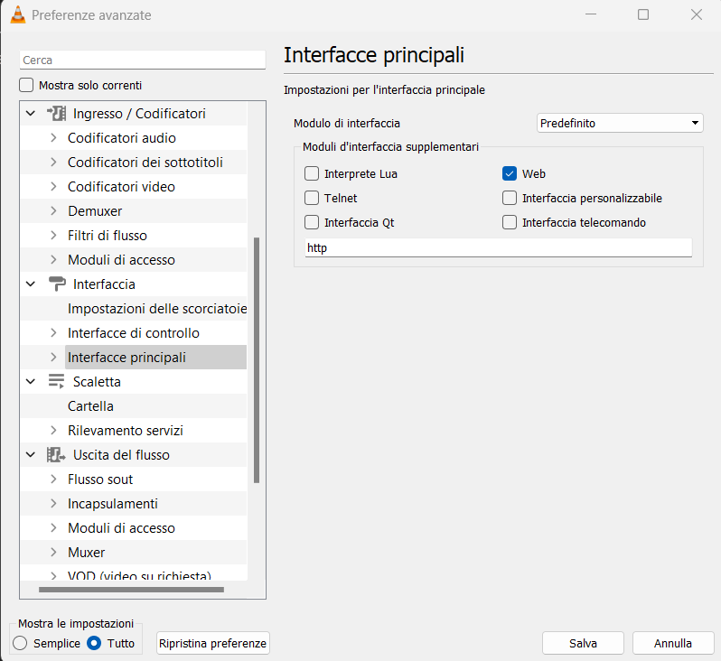
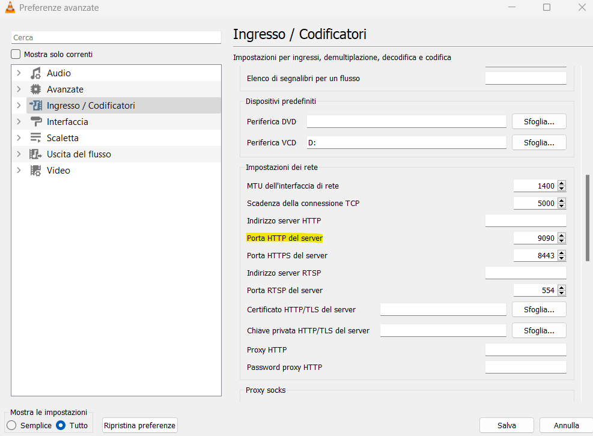
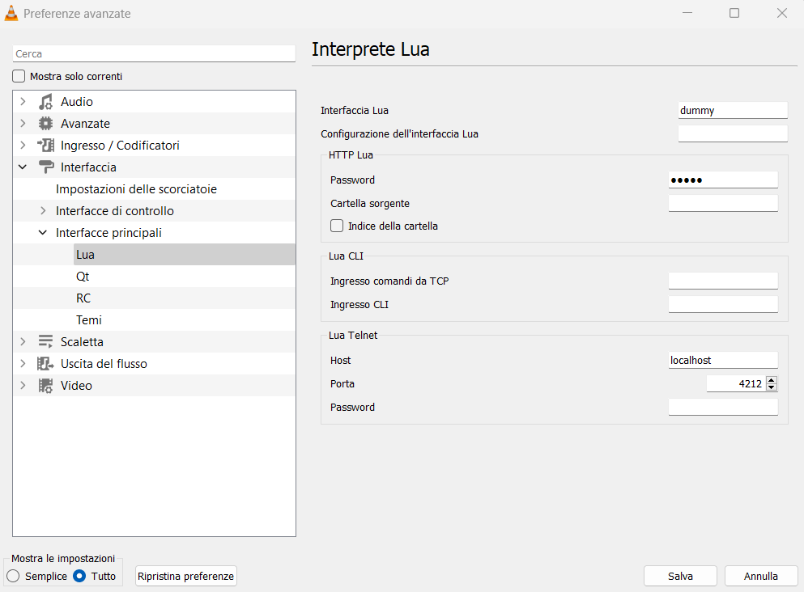
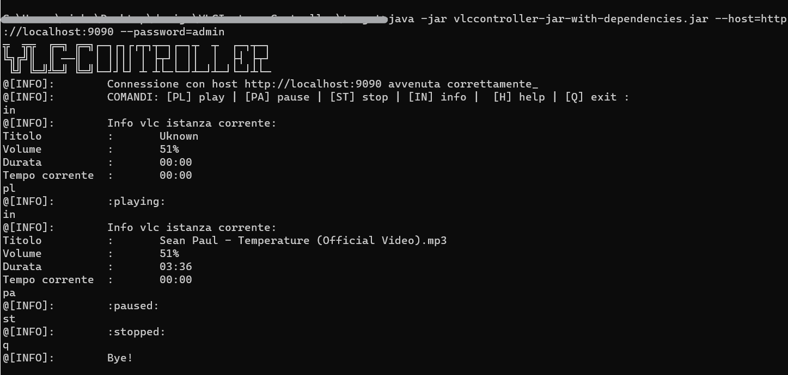

## Creazione programma Java per il controllo di una istanza VLC in esecuzione.


Ho pensato di progettare un command-line tool in grado di controllare un'istanza vlc in esecuzione sfruttando la sua interfaccia http configurabile.

Per poter comunicare correttamente con l'interfaccia, bisogna assicurarsi che sia abilitata da VLC.
Dall'interfaccia grafica (Qt):

- andare su Strumenti > Preferenze > Interfaccia > Interfacce principali;
- se non già spuntata, spuntare la voce _web_.




Quando si lancerà il programma, l'interfaccia http sarà in ascolto di default sulla porta 8080.
Se si intende cambiare la porta in ascolto basta configurarla da impostazioni:

-  Strumenti > Preferenze > Ingresso/Codificatori;
- cercare la voce _"Porta http del server"_ e impostare la porta desiderata.



---

### Utilizzo del tool in Java

Per l'utilizzo del programma in Java, si può procedere tramite creazione di un fat jar eseguibile eseguendo il comando : `mvn clean compile assembly:single` per utilizzarlo direttamente in un terminale, o eseguendolo da IDE, tenedo conto però che il programma prende in input dei paramentri.

Gli argomenti in input:

		[USAGE]: --password=<password> [--host=<host:port>]

							password :   la password dell'interfaccia vlc
							host     :   host dell'interfaccia (default: localhost:8080)


La password per comunicare con l'interfaccia va configurato da VLC:

- Strumenti > Preferenze > Interfaccia > Interfacce Principali > Lua > Http Lua;
- Inserire la password desiderata.




#### Esempio esecuzione programma:




### Pensieri sull'integrazione del codice in HSYCO

Per l'integrazione del codice prenderei in considerazione solamente la logica presente nella classe **VLCHttpInterface.java**, implementazione dell'interfaccia **VLCInterface.java**.

Partirei creando un Driver custom con il quale poter comunicare tramite protocollo http direttamente con l'interfaccia di vlc (come succede nella classe sopracitata).
Come suggerito dalla documentazione,  per tale scopo andrebbe innanzitutto settata la variabile **DEFAULTSOCKETPORT** a 80.
Nell'API  di un driver sembra essere disponibile il metodo **urlGet(String url, String user, String password)** in grado di ritornare la risposta in forma di Stringa dopo una richiesta http.
Dato che l'interfaccia http di vlc fa uso solamente del verbo GET per la gestione delle richieste, il metodo urlGet potrebbe essere essenziale per l'integrazione.
Per la gestione dei comandi, sfrutterei il metodo **command(String name, String value)** ed in base al nome (o al valore) fare un dispatch verso le chiamate http corrispondenti:

```
public void command(String name, String value){
	if(name.equals("pause")){
		Response rs = urlGet(url,null,pass);    //Response è un oggetto di esempio
	}
	...
}  
```

dove url potrebbe essere  `http://localhost:8080/requests/status.json?command=pl_pause` , mentre il ritorno il risultato del parsing della stringa json in oggetto Java (eseguibile con la libreria Gson).


